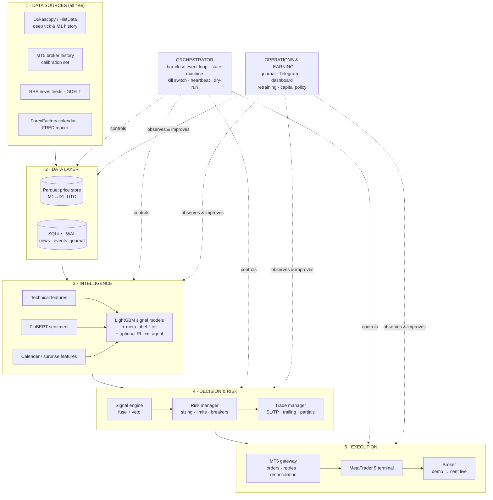
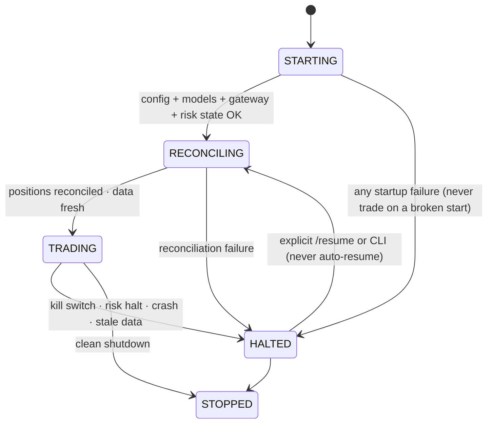

# Danalit — System Design

**An autonomous AI trading system for MetaTrader 5**
Instruments: EURUSD · XAUUSD (Gold) · US100 (NASDAQ 100 CFD)
Source specification: [Danalit_AI_Trading_System_Roadmap.pdf](Danalit_AI_Trading_System_Roadmap.pdf) (July 2026)

> Trading leveraged products involves substantial risk of loss. This is an engineering design, not financial advice.

---

## 1. Purpose and scope

Danalit ingests free historical and real-time price data plus a self-built news/macro archive, engineers
leakage-safe features, trains gradient-boosted signal models with walk-forward validation, and executes and
manages trades on MetaTrader 5 — entirely on a zero-budget, open-source stack, on Windows, operated by one
person.

**Non-goals (v1):** no end-to-end deep RL from raw data, no microservices/cloud queues, no online weight
updates from live trades, no paid data or hosting as load-bearing dependencies, no MT4.

**Design-driving constraints**

| Constraint | Consequence |
|---|---|
| $0 budget | Python OSS stack; Dukascopy/HistData/GDELT/FRED/RSS data; own PC hosting |
| MetaTrader5 Python package is Windows-only and needs a running terminal | Single Windows machine hosts terminal + Danalit; no Linux VPS |
| $20 starting capital | Cent account mandatory (balance in cents ⇒ professional 0.5–1% risk sizing is arithmetically possible) |
| One operator, part-time | Modular monolith; kill-safe/restart-safe by design; 5-min daily ops routine |
| Markets are near-efficient | Edge is small: honest validation doctrine, cost realism, and discipline are the product |

**Guiding principles** (from the roadmap, enforced structurally):

1. Capital preservation before profit — hard limits live only in the risk core and cannot be overridden by any model output.
2. Demo first, cents second, dollars later — written go-live checklist gates every promotion.
3. Free and open-source by default — free tiers must degrade gracefully.
4. No lookahead, ever — every feature/label/backtest respects information availability at decision time.
5. Everything journaled — including decisions *not* to trade, with full feature snapshots.
6. Config-driven, instrument-agnostic — instruments are YAML blocks, not code.
7. Simple models before complex ones — LightGBM is the workhorse; RL only if it beats the baseline out-of-sample.
8. One build prompt per session — build, review, test, commit (20-prompt plan, §14).

---

## 2. Architecture overview

Danalit is a **modular monolith**: one Python codebase, one machine, six layers with strict internal
boundaries, and two cross-cutting loops.



### 2.1 Layer responsibilities

| Layer | Modules | Responsibility |
|---|---|---|
| Data sources | Dukascopy/HistData downloaders, MT5 history, RSS/GDELT collectors, ForexFactory calendar, FRED | Acquire raw prices, news, macro events. All free. |
| Data layer | `price_store`, `dukascopy_ingest`, `mt5_history_ingest`, `news_ingest`, `calendar_ingest`, `fred_ingest`, `quality` | Validate, deduplicate, UTC-normalise. Parquet for bars/ticks; SQLite for news, events, trades, decisions. |
| Intelligence | `features.technical`, `features.sentiment`, `features.fundamental`, `labeling`, `dataset`, `models.*` | Leakage-safe features, FinBERT scoring, triple-barrier labels, LightGBM training/eval per instrument. |
| Decision & risk | `signal_engine`, `risk_manager`, `trade_manager` | Fuse probabilities + sentiment + calendar into one signal; size/limit/halt; manage SL/TP/trailing/partials. |
| Execution | `mt5_gateway`, `orchestrator` | The only MT5 boundary: orders with retries and reconciliation; bar-close event loop with state machine and kill switch. |
| Operations | `journal`, `monitor.telegram_bot`, `monitor.dashboard`, `models.retrain`, `risk.capital` | Journal everything, alert/control via Telegram, visualise via Streamlit, retrain with champion/challenger, capital policy. |

### 2.2 The two loops

**Fast loop (seconds–minutes).** On every completed M15 bar the orchestrator: pulls fresh bars and news →
recomputes features → `signal_engine.decide()` → `risk_manager.check_order()` → `mt5_gateway` execution.
Open positions are managed on every loop tick (trailing, breakeven, news blackout, time exits).

**Slow loop (weekly–monthly).** The journal accumulates every decision + feature snapshot + outcome. On
schedule, the retraining pipeline re-runs walk-forward training on the extended dataset; a challenger is
promoted only if it beats the champion on honest out-of-sample metrics. Continuous learning = disciplined
periodic retraining with promotion gates — never online weight updates per trade.

---

## 3. Technology stack

| Concern | Choice | Rationale |
|---|---|---|
| Language | Python 3.11+ | Whole ML/trading OSS ecosystem; official MT5 API is a pip package |
| Data | pandas, numpy, pyarrow (Parquet) | Fast columnar storage for years of M1 bars |
| Technical analysis | pandas-ta + hand-rolled S/R & patterns | Pure Python — no compiler needed on Windows (unlike TA-Lib) |
| Core ML | LightGBM + scikit-learn | Strongest tabular baseline; CPU-fast retrains; interpretable |
| News NLP | HuggingFace transformers + ProsusAI/finbert | Free finance-tuned sentiment; CPU-millisecond scoring |
| RL (optional) | Gymnasium + Stable-Baselines3 (PPO) | Exit-management agent only; tiny action space |
| Tuning | Optuna | Pruned search, LightGBM integration, resumable via SQLite trial log |
| Storage | Parquet + SQLite (WAL mode) | Zero-admin, zero-cost, single-machine reliable |
| Broker | `MetaTrader5` official pip package | Direct supported API into the running MT5 terminal |
| Scheduling | APScheduler + Windows Task Scheduler | In-process bar-close scheduling; OS-level autostart & watchdog |
| Dashboard | Streamlit + plotly | One-file localhost dashboard, no hosting |
| Alerts / remote control | python-telegram-bot | Free push + `/status` `/halt` `/resume` from a phone |
| Testing / VCS | pytest · Git (optional DVC) | Unit/integration/regression throughout |

**Why MT5, not MT4:** MT5 has an official Python package (quotes, bars, orders, positions, history) while
MT4 would require a fragile custom EA/ZeroMQ bridge. If ever forced onto MT4, only `mt5_gateway` changes
(dwx-zeromq fallback); everything else is unaffected.

---

## 4. Repository layout

```
danalit/                    # the package
  config.py                 # pydantic models over the two YAML files
  db.py                     # SQLite schema + migrations (python -m danalit.db --init)
  logging_setup.py          # rotating file handler per component, UTC timestamps
  constants.py
  data/                     # price_store, dukascopy_ingest, mt5_history_ingest,
                            # news_ingest, calendar_ingest, fred_ingest, gdelt_backfill,
                            # collector_daemon, quality
  features/                 # technical, sentiment, fundamental, labeling, dataset
  models/                   # train, calibrate, evaluate, registry, tuning, retrain,
                            # rl_exit/ (env, train, policy_manager)
  backtest/                 # engine, costs, metrics, report, walkforward
  risk/                     # risk_manager, position_sizing, capital   ← inviolable core
  trading/                  # signal_engine, trade_manager, mt5_gateway, orchestrator
  monitor/                  # notifier, telegram_bot, dashboard
  journal/                  # journal, analytics
config/
  settings.yaml             # paths, broker, risk, trading, news sections
  instruments.yaml          # one block per instrument (see §5)
scripts/                    # build_price_data, run_collector, build_dataset,
                            # train_models, run_walkforward, gateway_smoke_test,
                            # run_trading, journal_report, run_dashboard, run_retrain,
                            # deploy/ (install_tasks.ps1, watchdog.py)
tests/                      # unit + tests/integration/ (pytest -m integration)
data_store/                 # prices/{instrument}/{timeframe}/YYYY.parquet · danalit.db · datasets/
models_store/               # {instrument}/{version}/ · rl_exit/{version}/
reports/                    # eval, walk-forward, forward-test, retrain, digests
logs/
CLAUDE.md · README.md · RUNBOOK.md · DESIGN.md
```

**Dependency rules (enforced by review + tests):**

- `trading/mt5_gateway.py` is the **only** module allowed to `import MetaTrader5`.
- Position size is computed **only** in `danalit/risk/`; no other module may.
- `monitor/dashboard.py` reads only SQLite/Parquet — never the gateway.
- The signal engine is pure/deterministic (no side effects) so backtest and live share one code path.

---

## 5. Configuration design

`config.py` loads both YAML files into typed pydantic models. Secrets (`DANALIT_MT5_LOGIN/SERVER/PASSWORD`,
`FRED_API_KEY`, Telegram token/chat-id) come from environment variables only — never files.

**settings.yaml (sections and initial values)**

```yaml
paths: {data_store: data_store/, models_store: models_store/, reports: reports/, logs: logs/}
broker: {magic_number: 20260701, leverage: 500}          # login/server/password from env
risk:
  risk_per_trade: 0.0075        # 0.75% fixed-fractional
  max_positions: 2              # total; 1 per instrument
  max_total_risk: 0.015         # sum of open-position risk
  daily_loss_limit: 0.03        # halt until next UTC day
  weekly_loss_limit: 0.06       # halt for the week
  max_drawdown: 0.15            # circuit breaker from equity HWM → flatten + manual reset
  consecutive_loss_brake: 4     # 4 straight losses → halve risk for 24h
  min_lot_risk_cap_mult: 1.5    # refuse trade if min_lot forces risk > 1.5× risk_per_trade
trading:
  primary_timeframe: M15
  loop_interval_sec: 30
  dry_run: true                 # default until deliberately changed
  weekend_flatten_utc: "20:30"  # Fridays; never carry cent-account XAUUSD over weekends
news:
  poll_minutes: 5
  blackout_minutes: 15          # ± around high-impact events
```

**instruments.yaml (one block per instrument)**

```yaml
EURUSD:
  broker_symbol: EURUSD         # per-broker mapping ("XAUUSD" vs "GOLD", "US100" vs "USTEC"…)
  pip_size: 0.0001
  min_lot: 0.01
  lot_step: 0.01
  spread_estimate_pips: 1.2     # used until per-bar recorded spread available
  sessions: [london, newyork]
  enabled: true
  news_currencies: [USD, EUR]
XAUUSD: { ... , news_currencies: [USD] }
US100:  { ... , news_currencies: [USD] }
```

Contract specs (contract size, tick value, stops/freeze level, filling mode) are **cached from the live
terminal at startup and validated against config — mismatch refuses to start**.

---

## 6. Data design

### 6.1 Price store (Parquet)

- Layout: `data_store/prices/{instrument}/{timeframe}/{year}.parquet`
- Columns: `time_utc, open, high, low, close, tick_volume, spread` (+ `source`: dukascopy | broker)
- M1 is the only stored base; M5/M15/H1/H4/D1 are resampled from it (bars labelled by **open** time, UTC).
  Never store pre-aggregated data that can't be audited. ~3–4M M1 bars per instrument per decade — trivial.
- Merge policy: Dukascopy is the deep base (tick-accurate from ~2003, real spreads); broker MT5 history is
  preferred in the overlap window because it matches the exact prices/spreads that will be traded.
- `quality.py` emits a per-instrument markdown report: gaps vs trading calendar, zero-volume bars,
  duplicate timestamps, OHLC sanity, weekend data, spread outliers.

### 6.2 SQLite schema (WAL mode, `data_store/danalit.db`)

| Table | Key columns | Notes |
|---|---|---|
| `news` | id, source, **published_utc**, **ingested_utc**, title, body, url, `content_hash UNIQUE` | Two timestamps: we may only act on `ingested_utc` |
| `news_scores` | news_id, model_version, p_pos, p_neg, p_neu | FinBERT cache — re-runs incremental |
| `calendar_events` | id, source, event_utc, currency, name (canonical), impact, actual, forecast, previous, revised | Idempotent upserts; refetch fills `actual` after release |
| `gdelt_daily` | date, keyword_set, article_count, avg_tone | One-time 2015→ backfill |
| `decisions` | ts, instrument, action, confidence, sl, tp, explanation, features_snapshot JSON, mode (dry_run/demo/live), veto_reason | Every `decide()` call, **including NONE** |
| `orders` | client_id, signal_id, intent, result, retcode, intended_price, filled_price (⇒ slippage) | Intent journaled **before** send (crash safety) |
| `trades` | signal_id → entry deal → managed actions → exit deal, net P&L after all costs, MAE/MFE | Full lifecycle stitching |
| `managed_actions` | trade_id, rule_fired, before/after | Trade-manager rule log |
| `equity_snapshots` | ts, balance, equity, margin, open_risk | Every loop |
| `system_events` | ts, type (state transition, halt, error, reconciliation), detail | |
| `model_registry` | instrument, version, dataset_version, metrics JSON, git_commit, champion flag | Champion pointer updated atomically |
| `risk_state` | HWM, daily/weekly counters, consecutive-loss counter, tier | Persisted so restarts can't reset limits |
| `set_aside_ledger` | month, net_pnl, credit, balance, withdrawals | Virtual ledger (§12.3) |
| `optuna_trials` | study, trial params/metrics | Auditable, resumable search |

Journal tables are **append-only**, with an export-to-Parquet snapshot command for offline research.

### 6.3 Data sources and acquisition

| Source | Provides | Access |
|---|---|---|
| Dukascopy | Tick data from ~2003 for EURUSD, XAUUSD, USATEC.IDX/USD — the deep training archive | `dukascopy-node` CLI (npm); Danalit ingests its CSVs |
| HistData.com | Free M1 FX + XAUUSD back to ~2000 (no NASDAQ) | Cross-check for Dukascopy |
| Broker MT5 history | 5–10+ years M1 at the *exact* prices/spreads to be traded | `copy_rates_range()` in chunks; calibrates the cost model |
| ForexFactory calendar | Event, currency, impact, actual/forecast/previous | Free weekly JSON (`ff_calendar_thisweek.json` on faireconomy.media); polite scrape (1 req/2s, cached, resumable) for 2014→ backfill |
| FRED | Authoritative macro series (CPI, NFP, rates, PCE, GDP…) with release dates | Free API key — backbone of historical *surprise* features |
| GDELT 2.0 | Article counts + tone per keyword set, 15-min granularity back to 2015 | Free DOC 2.0 API; use aggregates, never single articles |
| RSS | Real-time headlines: FXStreet, Investing.com, DailyFX, Google News queries | Poll every 5 min — feeds live sentiment **and builds the proprietary archive** |
| Finnhub / Marketaux / AlphaVantage | Optional tagged news | Tight free tiers — supplements, never load-bearing |

**The collector daemon runs 24/7 from week 1** (APScheduler: calendar every 30 min, RSS every 5 min;
per-source error isolation; heartbeat file). Months of perfectly timestamped news — aligned exactly with how
the live system sees news — are worth more than any noisy backfill. Timestamped historical news is the one
dataset money normally buys; the archive becomes the project's proprietary asset.

---

## 7. Intelligence design

Deliberately **layered, not end-to-end** — each layer simple enough to validate independently:

```
1. Signal models   (supervised, core)      LightGBM 3-class per instrument
2. Meta-label filter (supervised, refine)  "is the primary signal trustworthy?"  [de Prado]
3. Sentiment engine (pretrained NLP)       FinBERT scores → rolling aggregates (never fine-tuned in v1)
4. Calendar layer   (rules, not ML)        blackout windows + surprise z-scores
5. RL exit agent    (optional, last)       PPO over {hold, tighten, partial, exit} — adopt only if it wins
```

### 7.1 Technical features (`features/technical.py`)

Computed on M15 unless noted; ~80–150 features, all config-driven, registered in `FEATURE_REGISTRY`
(name → description/params) for documentation and drift monitoring.

- **Trend/momentum:** EMA(8/21/50/200) distances in ATR units + slopes; MACD histogram + slope; RSI(14) + divergence flag; ADX(14); ROC over 4/16/96 bars.
- **Volatility:** ATR(14)/price; ATR percentile (90d); Bollinger width & %B; range-regime flag.
- **Structure:** ATR-distance to rolling swing highs/lows (fractal pivots over 20/100/500 bars); round-number proximity (00/50 for EURUSD, 10s for XAUUSD, 100s for US100); yesterday/last-week high–low distances.
- **Patterns:** pandas-ta `cdl_*` collapsed into bullish/bearish/none scores.
- **Multi-timeframe:** H1/H4 trend direction (EMA stack), H4 RSI, D1 ATR percentile — joined **as-of the last CLOSED higher-TF bar** (no peeking into a forming bar; tested explicitly).
- **Time:** sin/cos hour & weekday; session flags (Tokyo/London/NY/overlap); minutes-since-session-open; bars-to-weekend.

**The leakage invariant (overrides everything):** a feature value at bar T may use only data with
`time_utc ≤ T's close`; features are consumed at the next bar's open. Proven by a truncation test:
features computed on full history vs history truncated at T must be identical at T.

### 7.2 Sentiment & fundamental features

- FinBERT scores every headline (title + summary) on CPU; cached by `news_id + model_version`.
- Keyword→entity tagger maps headlines to affected assets (USD, EUR, gold, nasdaq/equities; lists in config).
- Per instrument, aligned to M15 bars **by `ingested_utc`, never `published_utc`** (a headline ingested
  12:07 first affects the bar closing 12:15): rolling net sentiment (pos−neg, confidence-weighted) over
  1h/4h/24h per entity; article count vs 30-day average; max single-article negativity in last 4h.
- Calendar features per bar: `minutes_to_next_high_impact` (capped), `minutes_since_last_high_impact`,
  event counts next 24h for the instrument's `news_currencies`, blackout flag (±15 min), and post-release
  **surprise** = (actual − forecast) z-scored against that event's own history, decayed over 8h.
  Event-name normalisation maps variants to one canonical name.
- **Graceful degradation:** where history is thin (before the collector started), features degrade to
  neutral values with an availability-mask column per feature group, so models learn with and without news
  (technical features carry the model; news enhances it).

### 7.3 Labeling and datasets

**Triple-barrier method:** for each bar T (entry at next bar open): upper barrier = entry + k_tp·ATR(14),
lower = entry − k_sl·ATR(14), time barrier = N bars. Defaults `k_tp=2.0, k_sl=1.0, N=96` (M15); all
configurable. Label +1 if upper first, −1 if lower first; on timeout, sign of return with a ±0.25·ATR dead
zone → else 0. **Costs are inside the labels:** entry pays the spread (buy at ask), barrier checks use bid
for longs. Both long- and short-framed labels are emitted → 3-class problem
(profitable-long / profitable-short / no-trade). Exact barrier prices, hit time and realised return are
emitted — the backtester reuses these definitions verbatim.

**Purged walk-forward splitting:** e.g. train 2016–2021 → validate 2022 → test 2023–2024, then roll.
Training samples whose label window overlaps validation are **purged**; a configurable **embargo**
(default 5 days) follows each train window. No random shuffles anywhere. Datasets are versioned on disk
with `manifest.json` (features, label params, folds, row counts, class balance, git commit) and are
deterministic (same inputs ⇒ identical hash).

### 7.4 Models, calibration, registry

- LightGBM multiclass per instrument, per fold (fold k's model never sees fold k's val/test). Shallow
  (depth 4–6), high `min_child_samples`, `feature_fraction≈0.8`, early stopping on validation, class weights.
- **Isotonic calibration** per fold on the validation split — "62% confidence" must mean 62%, because
  position-taking thresholds depend on it. Reliability diagrams saved to reports.
- Evaluation report per instrument/version: log loss, per-class precision/recall, and the trading-relevant
  view — for τ ∈ 0.45..0.70: signal count, hit rate, avg labeled return **after costs**, expectancy;
  expectancy-vs-τ plot; top-30 feature importances grouped technical/news/calendar; by-year and by-session
  breakdowns. **Honesty rule:** if out-of-sample expectancy is ≈ 0 or negative, the report says so plainly;
  never tuned on test data to fix it.
- Registry: every model saved under `models_store/{instrument}/{version}/` (fold models, calibrators,
  feature list, dataset version, metrics.json, git commit); `load_latest(instrument)` API; champion pointer.

### 7.5 Validation doctrine

- **Walk-forward everything** — headline numbers only ever come from data the model never saw in any form.
- **Purging + embargo** — label-horizon leakage cannot inflate results.
- **Probability calibration** — sizing depends on honest probabilities.
- **Overfitting guards** — Optuna trial counts reported; deflated Sharpe ratio; probability-of-backtest-
  overfitting check; parameter-sensitivity table (τ ±0.05, k's ±25% — a real edge degrades smoothly, a fake
  one cliffs); a strategy that only shines under one parameter set is discarded.
- **Cost realism** — spread, commission, slippage, swap in every label and every backtest from day one.
- **Monte Carlo stress** — bootstrap trade sequences → drawdown distribution and P(ruin) at the risk
  settings; rerun at 1.5× and 2× costs; the strategy must survive degraded execution.

**Forbidden (common causes of death):** training on data the live broker can't provide; tuning on the test
set (even once); models outputting position size; online-updating weights from live trades; adding
instruments before EURUSD alone is stable; trusting any backtest whose equity curve wasn't inspected
trade-by-trade.

---

## 8. Backtesting design

**Core constraint:** the backtester's position/SL/TP lifecycle semantics **exactly match MT5's**, because the
live modules reuse them. It consumes a `Strategy` interface (`on_bar(context) -> orders`) and a cost model —
the same `MLSignalStrategy` → later the same unified signal engine → runs in both worlds.

- Event-driven loop over M15 bars, multi-instrument, one portfolio. Orders created at bar close execute at
  **next bar open ± slippage**.
- Intrabar SL/TP resolution from OHLC with the **pessimistic rule** (both in range ⇒ SL first).
  Gap handling: fills at the gapped open, not the stop price.
- Supports market orders with attached SL/TP, modify-SL/TP (trailing), partial close, close-all;
  equity/balance/margin tracked per bar; margin model from contract specs at configurable leverage
  (default 1:500 cent-account style).
- Cost model per instrument: spread (per-bar recorded spread when present, else config estimate; entries pay
  it), commission per lot, slippage (fixed pips + extra within ±15 min of high-impact events), swap per night
  including triple-swap Wednesday.
- Metrics: net profit, profit factor, expectancy, win rate, max drawdown (equity and balance basis), CAGR,
  Sharpe/Sortino, duration stats, consecutive-loss runs, per-instrument/per-year breakdowns.
- HTML report (plotly): equity curve with drawdown shading, monthly returns, trade distributions, and a
  **cost breakdown showing exactly how much spread/swap ate** (gross vs net).
- Validated against hand-computed P&L on synthetic paths, to the cent.

**Walk-forward harness** stitches per-fold test periods into one continuous out-of-sample equity curve — the
headline result. Optuna tunes (τ, k_tp, k_sl, N, LightGBM depth/leaves/min_child) on **validation splits
only**; test periods are touched exactly once by the final configuration; fold isolation is enforced by an
explicit guard class (test-period timestamps asserted never to reach training/tuning code paths), not just
discipline. The report ends with a plain-language verdict: *edge or no edge, and confidence* — and if
negative, lists the §15 fallback options instead of suggesting more tuning.

---

## 9. Decision & risk design

### 9.1 Signal engine (`trading/signal_engine.py`) — the single decision point

```python
decide(instrument, now) -> Decision(
    action: LONG | SHORT | NONE,
    confidence: float,
    sl_price, tp_price,          # from the ATR label barriers
    explanation: str,            # "LONG EURUSD p=0.64 tau=0.55 | H4 up | sent +0.3 | ADX 28 | next high-impact 4h12m"
    features_snapshot: dict,     # journaled on EVERY call, including NONE
)
```

Pure and deterministic (no side effects) ⇒ identical in backtest and live. Pipeline in order — each stage
can veto, and vetoes are recorded with reasons:

1. **Data freshness gate** — bars current within 2 bar-intervals; collector heartbeat fresh → else `NONE("stale data")`.
2. **Calendar gate** — inside blackout window → `NONE("news blackout")`.
3. **Regime filter** — config-driven; default: ADX(H1) > threshold OR ATR percentile in a tradable band (band comes from walk-forward analysis of where the model earns).
4. **Model signal** — champion model from registry; calibrated P_long/P_short/P_none; require max(P_long,P_short) > τ (per-instrument τ from walk-forward).
5. **Sentiment veto** (config-gated) — block LONG on strongly negative net 4h sentiment (beyond configured percentile) and vice versa; logged distinctly for later keep/kill evaluation.
6. **Confluence bonus** — model direction + H4 trend + sentiment sign all agree ⇒ confidence bonus (journal analytics only; does **not** affect sizing in v1).

A golden-file test pins decisions over a fixed historical week so refactors can't silently change behaviour.

### 9.2 Risk manager (`risk/`) — the inviolable core

The most safety-critical code: **every order ever sent passes through it, in backtest and live identically.**
No other module may compute a position size.

**Sizing (fixed-fractional):**
`size = (equity × risk_per_trade) / (sl_distance × value_per_price_unit_per_lot)`, floored to `lot_step`,
respecting `min_lot`/`max_lot` and margin headroom. All arithmetic in account-currency units (USD **cents**
on a cent account). If `min_lot` forces risk above `1.5 × risk_per_trade`, the trade is **refused** with the
reason. (This is why the cent account is a hard prerequisite: on a standard account, 0.01 lots EURUSD ≈
$0.10/pip ⇒ a 20-pip stop risks 10% of $20 — structurally untradable; on a cent account the same stop risks
~0.1%.)

**Gatekeeper API:** `check_order(proposed) -> Approved(sizing) | Rejected(reason)`, plus
`on_trade_closed()`, `on_equity_snapshot()`. Every rejection logged with full context.

| Rule | Initial value | Behaviour |
|---|---|---|
| Risk per trade | 0.75% of equity | Derived from entry-to-SL distance; never chosen by a model |
| Max concurrent positions | 2 (1 per instrument) | Caps correlation and total heat |
| Max total open risk | 1.5% of equity | Sum of open-position risk |
| Daily loss limit | 3% (UTC day, realised + open P&L) | Halt until next day; Telegram alert |
| Weekly loss limit | 6% | Halt for the week; forces review |
| Drawdown circuit breaker | 15% from equity high-water mark | `FLATTEN_AND_HALT`; manual CLI reset only, after review |
| News blackout | ±15 min around high-impact events | No entries; optionally tighten stops on open positions |
| Consecutive-loss brake | 4 losses in a row | Risk per trade halves for 24h |
| Tier gating | equity tiers (§12.3) | Instruments unlock as equity grows |

State (HWM, daily/weekly counters, loss streak, tier) **persists to SQLite** so restarts cannot reset limits.
Target: >95% branch coverage; sizing verified to the cent for a 2,000-cent account with 15–40 pip stops.

### 9.3 Trade manager (`trading/trade_manager.py`)

Manages open positions only, on a normalised `Position` object, identically in backtest (each bar) and live
(each loop tick). Rules in documented priority order (news overrides others; breakeven before trailing;
time exit last), all config-per-instrument:

1. **Initial protection:** every entry gets SL = k_sl·ATR, TP = k_tp·ATR — *the same barriers as the training labels; consistency between training and live behaviour is the point.*
2. **Breakeven:** at +1.0·ATR unrealised, SL → entry + spread.
3. **ATR trailing:** after breakeven, trail 1.5·ATR behind best price, monotonic only (never widen).
4. **Partial TP:** close 50% at +1.0·ATR; skip if position < 2×min_lot (can't split).
5. **Time exit:** close positions older than N_hold bars (default = label horizon N).
6. **News protection:** within blackout window — tighten SL to 0.5·ATR or flatten, per config.
7. **Weekend rule:** flatten Friday 20:30 UTC (config) unless told to carry; never carry cent-account XAUUSD over a weekend.

Every rule firing emits a `managed_actions` journal row (position, rule, before/after). Walk-forward is run
management-on vs management-off and the comparison is reported (management should cut drawdown; expectancy
may dip slightly — both outcomes are data, not failure).

### 9.4 Optional RL exit agent (`models/rl_exit/`)

Skippable without breaking anything; selected by config as a `TradeManager`-compatible adapter.
Gymnasium env wraps the backtester for single-position management; episodes are historical trades entered by
the signal engine, sampled from **training folds only**. Observation: unrealised P&L in ATR, bars-in-trade /
horizon, ATR percentile, distances to SL/TP in ATR, H1 trend agreement, minutes-to-next-high-impact,
position fraction remaining. Action space Discrete(4): hold / tighten SL to 1.0·ATR / close 50% / close all.
Reward: realised P&L change per step net of costs, small time penalty. PPO (SB3, small MLP, seeded).
**Adoption gate:** replay walk-forward *test* folds with rule-manager vs RL-manager on identical entries and
costs; adopt only if expectancy improves without materially worse drawdown — shipping "KEEP RULES" is a
fully successful outcome.

---

## 10. Execution design

### 10.1 MT5 gateway (`trading/mt5_gateway.py`)

The only module that imports `MetaTrader5`; everything else uses its normalised types
(`Position`, `OrderResult`, `Tick`, `Bar`).

- **Connection:** `initialize()/login()` from env vars; `ensure_connected()` health check before every
  operation with auto-reinitialise after terminal restarts; clear fatal error if no terminal.
  All prices/times normalised to UTC.
- **Symbols:** canonical → broker symbol from `instruments.yaml`; startup verifies each symbol exists and is
  visible, caches contract specs (contract size, tick value/size, min/step/max lot, stops_level,
  freeze_level, trade mode), and **refuses to start if config mismatches live specs**.
- **Orders:** `market_order(instrument, side, lots, sl, tp, comment)` with per-symbol filling-mode detection
  (IOC/FOK); `modify_position_sltp()`; `close_position()` + partial close by ticket. Retcode policy table:
  requote/price-off → retry ≤3× with fresh price and backoff; no-money/invalid-stops/market-closed → fail
  fast with typed errors; trade-context-busy → short backoff retry. `stops_level` minimum distances are
  respected by adjusting or refusing (logged which).
- **All SL/TP live at the broker, attached to the position — never only in Python.** Trailing modifies the
  broker-side stop. If the machine dies mid-trade, worst case is bounded.
- **Identity:** every order tagged with the config magic number + structured comment `danalit:{signal_id}`.
- **Reconciliation:** `reconcile(journal_state)` reports broker-not-journal positions (*orphans*) and
  journal-not-broker (*ghosts*), with policy hooks: adopt orphan / flatten orphan / mark ghost closed.
- Demo and live use the **same gateway** — only login config changes, making the demo forward test a true
  dress rehearsal. The smoke-test script aborts on a non-demo account unless `--i-know-this-is-live`.

### 10.2 Orchestrator (`trading/orchestrator.py`) — explicit state machine



- **Startup sequence** (any failure → HALTED with reason): load config + champion models → gateway connect +
  symbol validation → risk-state load (HWM, counters) → reconcile positions vs journal (apply orphan/ghost
  policy, log every resolution) → verify data freshness (price store current, collector heartbeat).
- **Main loop** (APScheduler, every `loop_interval_sec`):
  (a) refresh bars/calendar/news; (b) on each **new completed M15 bar** per instrument:
  `trade_manager` on open positions **first**, then `signal_engine.decide()` → `risk_manager.check_order()`
  → gateway execution; (c) every tick: kill switch + risk-halt checks; (d) heartbeat file + equity snapshot.
- **Kill switch:** `HALT` file in repo root (or Telegram `/halt`) stops new entries; `HALT_FLAT` also
  flattens. Deleting the file does **not** resume — resume is an explicit CLI/Telegram action (no flapping).
- **Dry-run mode** (default on): full pipeline, gateway calls logged-not-sent, decisions journaled with
  `mode='dry_run'` — the first end-to-end test.
- **Crash safety (two-generals):** every intended order journaled **before** sending with a client-side id;
  restart reconciliation matches intents to broker deals so a crash between send and ack cannot double-fire.
- Global exception handler: log → Telegram CRITICAL → HALTED. Never a silent dead process (watchdog covers
  hangs).

---

## 11. Journal & analytics

The journal is the evidence base for go-live and the substrate for continuous learning. Tables in §6.2;
analytics (`journal/analytics.py`) produce `reports/forward_test_{period}.html`:

- **Execution quality:** realised spread + slippage distributions vs the backtester's cost-model assumptions — *the* key go-live input; flags when live costs exceed modeled costs.
- **Performance:** live equity curve vs the walk-forward Monte Carlo cone; win rate / expectancy / PF with confidence intervals for N trades so far.
- **Model behaviour:** live P_long/P_short distributions vs training-time (drift); veto/rejection frequency by reason; decision latency.
- **Discipline audit:** orders not preceded by an approved decision (**must be zero**); risk rejections overridden (**must be zero**).
- **Go-live checklist section** auto-fills the measurable Chapter-10 items (weeks run, trade count, PF, DD, cost deviation) with PASS/FAIL against config thresholds — and renders honest FAILs until they're earned.

---

## 12. Operations design

### 12.1 Monitoring — Telegram + Streamlit

- `Notifier` interface used by orchestrator/risk/gateway: `notify(level, title, body)`. Levels: INFO (trade
  open/close + P&L + explanation; rate-limited/batched), WARNING (halts, staleness, reconciliation
  findings), CRITICAL (crash, drawdown breaker, repeated order failures; always immediate). Graceful no-op
  if unconfigured.
- Telegram bot (whitelisted chat id only): `/status` (state, equity, positions, day P&L, data freshness,
  heartbeat age), `/positions`, `/halt`, `/halt_flat`, `/resume`, `/report`.
- **Daily digest** (21:00 UTC): equity + day P&L, trades with one-line explanations, open risk, risk-limit
  headroom, decision counts by outcome, collector health, disk space → Telegram + `reports/digests/`.
- Streamlit dashboard (localhost, reads only SQLite/Parquet): equity vs Monte Carlo cone, open positions,
  last 50 decisions with explanations/vetoes, forward-vs-backtest cost panel, feature-drift sparklines,
  collector heartbeat.

### 12.2 Continuous learning — retraining pipeline

Monthly (or manual, or drift-recommended) run:

1. Rebuild dataset through yesterday (now including *real* collected news history).
2. Retrain with **frozen champion hyperparameters** (full re-tuning stays a manual, deliberate act).
3. Evaluate challenger on an 8-week holdout neither model trained on, **plus** replay the walk-forward test protocol.
4. **Promotion gate:** challenger promotes only if holdout expectancy ≥ champion's AND max drawdown ≤ champion's × 1.1 AND calibration not worse. Either way, write `reports/retrain_{date}.md` with the rationale.
5. Champion pointer updated atomically; orchestrator hot-swaps only in HALTED/no-open-positions state.
6. **Post-promotion probation:** for 2 weeks, live expectancy is compared to the challenger's holdout expectancy; degradation beyond a configured band → **auto-rollback** + CRITICAL notification.
7. **Drift trigger:** weekly PSI between training feature distributions and the last 4 weeks of live snapshots; PSI over threshold → WARNING recommending early retrain. Never auto-retrain on drift alone — a human stays in the loop.

### 12.3 Capital policy (`risk/capital.py`)

| Equity | Instruments live | Risk/trade | Profit set-aside |
|---|---|---|---|
| < $50 | EURUSD | 0.75% | 0% — compound everything |
| $50–200 | + XAUUSD | 0.75% | 10% of monthly net profit |
| $200–1,000 | all three | 1.0% | 25% |
| > $1,000 | all three + shadow candidates | 1.0% | 40%, monthly withdrawal recommendation |

- **Tier hysteresis:** changes require 5 consecutive trading days beyond the boundary, apply only at day
  rollover, never mid-trade, always Telegram-notified.
- **Set-aside ledger (virtual):** at month end, positive net P&L credits the ledger by the tier percentage.
  Money stays at the broker, but **position sizing uses working equity = broker equity − set-aside balance**.
- **Withdrawals:** when the ledger ≥ configured minimum (default $25), the monthly report recommends one;
  `danalit capital withdraw <amount>` records it. The actual broker withdrawal is manual — by design, no API
  can move money.
- **Drawdown interaction:** set-aside credits pause while equity < HWM (recover first, skim later).
- Monthly report: equity vs HWM, tier, working equity, ledger, months-to-next-tier at current expectancy,
  compounding projection table (conservative/expected/optimistic from Monte Carlo percentiles — labeled
  projections, not promises).

### 12.4 Deployment & hardening

- **Hosting phases:** dev/backtesting on the main PC ($0) → demo forward test on PC or old laptop ($0) →
  live on a dedicated always-on Windows machine (old laptop ideal; battery = free UPS) → broker free VPS
  once equity/volume qualifies (Exness/RoboForex/FBS grant one). Oracle Free Tier is Linux/ARM — can't run
  MT5; ignored.
- **Process management:** Task Scheduler entries (via `install_tasks.ps1`) — MT5 terminal at logon,
  collector at logon, orchestrator at logon (dry-run per config), optional dashboard, watchdog every 5 min,
  monthly retrain, daily digest. Sleep/hibernate disabled, Windows Update deferred.
- **Watchdog:** checks orchestrator + collector heartbeat files, restarts stale tasks, with restart-storm
  protection (max 3/hour, then CRITICAL and stop).
- **Failure injection tests:** gateway timeouts/requotes/disconnects mid-sequence; SQLite locked/disk-full on
  journal write (**orders fail CLOSED — no journal, no order**); corrupted config (refuse to start); clock
  skew vs broker (warn/halt thresholds); collector dead >30 min during TRADING (stale-data vetoes must fire).
- **Preflight:** `danalit preflight` — config validation, gateway smoke checks (demo), DB integrity, disk
  space, clock sync, registry sanity, pending migrations → PASS/FAIL table. Orchestrator refuses TRADING if
  preflight fails.
- **RUNBOOK.md:** cold start; clean shutdown; resume after halt; drawdown-breaker manual reset (with
  mandatory review questions); broker maintenance windows; meaning + first three diagnostic steps for every
  CRITICAL alert; demo→live switchover procedure; "break glass" manual flatten in the MT5 terminal.

---

## 13. Testing strategy — the four gates

1. **Unit & integration tests** (continuous): every module ships pytest tests; risk manager and backtester get the densest coverage because errors there are unbounded.
2. **Backtesting:** event-driven over 8–12 years, full cost model, walk-forward only; ≥ ~500 trades per instrument for statistical meaning; equity curves, drawdown profiles, duration distributions, per-regime performance inspected.
3. **Monte Carlo stress:** bootstrap-resampled drawdown distributions ("5% chance of a 22% drawdown"); reruns at 1.5× and 2× costs.
4. **Forward test on demo (the only gate that matters):** ≥ 12 weeks and ≥ 100 trades running the complete live system; journal analytics compare realised vs backtest trade-by-trade; deviation beyond confidence bands ⇒ stop and diagnose.

**Go-live checklist (all must be true):** ≥12 weeks / ≥100 trades on demo without manual intervention ·
forward PF ≥ 1.15 and expectancy inside Monte Carlo bands · max forward DD < 12% with the daily-loss halt
proven to fire · every operational failure mode rehearsed (terminal restart, reboot mid-trade, internet
loss, kill switch, weekend gap over an open position) · Telegram verified end-to-end and dashboard matching
broker statements · runbook read and executable.

---

## 14. Build plan — 20 prompts, 6 phases

One prompt per Claude Code session, in order; each ends with a Definition of Done. Read → test → run once by
hand → commit before the next. (Full prompt texts are in the PDF, Chapter 13.)

| Phase | Weeks | Prompts | Milestone |
|---|---|---|---|
| A · Foundation | 1–2 | 1 scaffold/config/DB · 2 price pipeline · 3 news collector | Repo scaffolded; 10 years of prices stored; **collector running 24/7 from now on** |
| B · Features & labels | 3–4 | 4 technical · 5 sentiment/fundamental · 6 labeling/datasets | Leakage-safe feature matrix + labelled datasets, all three instruments |
| C · Models & backtest | 5–8 | 7 baseline models · 8 backtester · 9 walk-forward | **First honest walk-forward report; go/no-go on the edge** |
| D · Decision & risk | 9–11 | 10 risk manager · 11 trade manager · 12 signal engine · 13 RL exit (optional) | Full decision pipeline passing simulated trading tests |
| E · Execution | 12–14 | 14 MT5 gateway · 15 orchestrator · 16 journal/analytics | System trading a demo account end-to-end, fully journaled |
| F · Operations | 15–16 | 17 monitoring · 18 retraining · 19 capital policy · 20 hardening/runbook | Forward test formally begins |
| Forward test | 17–28 | — | ≥12 weeks, ≥100 trades on demo; go-live checklist evaluated |
| Live | 29+ | — | $20 cent account at tier-1 risk; monthly capital reviews |

---

## 15. Known risks and planned responses

| Risk | Response designed in |
|---|---|
| **Backtest shows no edge at week 8** (most likely failure — a scheduled decision, not a surprise) | In order: (1) enrich features (higher-TF context, cross-asset: DXY/yields for gold, VIX for US100); (2) change trade definition (H1 horizon, barrier multiples); (3) session-specific scope (e.g. London open only); (4) meta-labeling over a classic rule-based signal with ML as filter. Infrastructure is edge-agnostic — nothing is wasted. |
| Leakage inflating backtests | Truncation tests, as-of higher-TF joins, ingested-time news alignment, purge+embargo, fold-isolation guard class |
| Overfitting via tuning | Optuna confined to validation splits; deflated Sharpe; sensitivity tables; PBO check; test touched once |
| Tiny-account arithmetic | Cent account prerequisite; min-lot refusal rule; cent-exact sizing tests |
| Machine/terminal dies mid-trade | Broker-side SL/TP always; restart reconciliation; intent-before-send journaling; watchdog + heartbeat |
| Free data source disappears | No free tier is load-bearing; neutral-degradation feature masks; multiple price sources |
| Model degrades after promotion | Champion/challenger gates, 2-week probation with auto-rollback, PSI drift monitoring |
| Human error in ops | Kill switch, explicit resume, preflight, runbook, discipline audit (zero unapproved orders) |

**Year-one success criteria:** (1) a complete, tested, monitored autonomous system; (2) a 12-week forward
test matching backtest within tolerance; (3) a live cent account that survives within drawdown limits while
compounding modestly; (4) a growing proprietary news/decision dataset and a retraining loop that measurably
improves the model.
